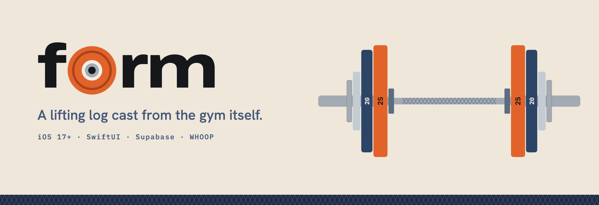
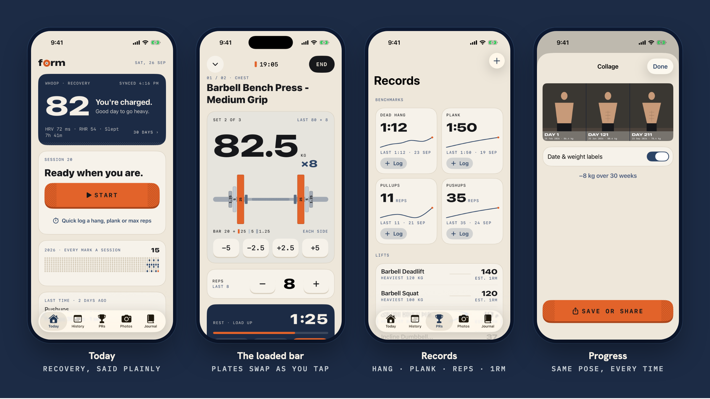
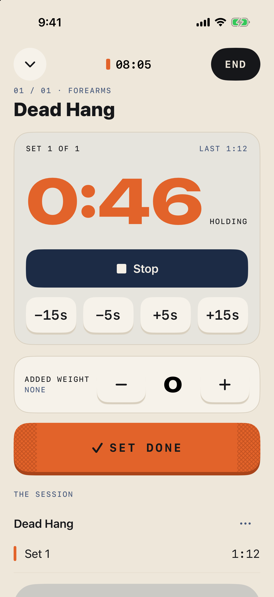
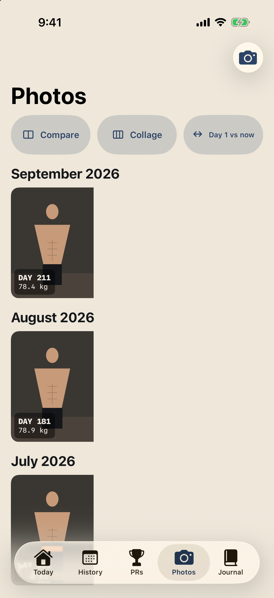

<p align="center">
  
</p>

<p align="center">
  
  
  
  
  
  
  
</p>

<p align="center">
  <b>Log the set. Load the bar. Watch the body change.</b><br>
  A personal lifting log for iPhone: fast set logging, WHOOP recovery and strain,<br>
  and same-pose progress photos that turn months of training into one picture.
</p>

<p align="center">
  
</p>

---

## Why Form

Most workout apps are dashboards of numbers. Form is built around three things that actually keep you going:

1. **Logging that gets out of the way.** One job per screen: a huge number and one chunky key you can hit with chalky hands.
2. **Knowing how hard to push.** WHOOP recovery, said in a sentence ("82 — You're charged. Good day to go heavy.").
3. **Seeing the change.** A progress photo after each session, lined up against a ghost of the last one, so Day 1 → Day 211 reads like a time-lapse.

It also works with no signal. Every tap is saved on the phone first and synced later.

## Features

<table>
<tr>
<td width="50%" valign="top">

### The loaded bar
Set 82.5 kg and the bar draws **25 + 5 + 1.25 per side** in calibrated plate colours. Tap +2.5 and the plates swap live. It doubles as a plate calculator. Dumbbells show a pair; machines show the stack.

</td>
<td width="50%" valign="top">

### Holds and bodyweight
Dead hang, plank and L-sit get a **stopwatch**, with time as the score. Pull-ups, push-ups and dips make **reps** the big number, with optional added weight. PRs are tracked per metric.

</td>
</tr>
<tr>
<td valign="top">

### WHOOP, properly
Recovery, HRV, resting HR and sleep on Today; 30-day recovery, sleep and strain charts. Each session picks up its **strain, avg/max heart rate and calories**. WHOOP-only activities are imported, and your whole history is backfilled once.

</td>
<td valign="top">

### Progress photos
The camera shows your **last photo as a ghost** so every shot lines up. Timeline with day numbers and weight, a **compare slider**, and a **2–4 photo collage** ready to share. Photos are private to you.

</td>
</tr>
<tr>
<td valign="top">

### Records
Benchmarks for dead hang, plank, max pull-ups and max push-ups with trends, plus lift PRs by estimated 1RM. **Quick log** a result any time, even for a past date.

</td>
<td valign="top">

### Offline-first
The active workout is written to disk on every tap and survives the app being killed. Finished sessions and photos queue locally and upload when you're back online. Retries are idempotent, so nothing is ever duplicated.

</td>
</tr>
</table>

<p align="center">
  
  &nbsp;&nbsp;
  
</p>
<p align="center"><sub>A dead hang on the stopwatch · the photo timeline, day by day</sub></p>

## Design: chalk, iron and plates

Everything comes from the gym floor: bone and ink neutrals, muted navy and denim blues, one burnt-orange accent for the thing you press. Numbers are set like the lettering cast into iron plates, and the knurl of a barbell grip shows up as texture.

| Role | Colour | | Plates | Colour |
|---|---|---|---|---|
| Bone (ground) |  | | 25 kg |  |
| Ink (text) |  | | 20 kg |  |
| Navy (hero) |  | | 15 kg |  |
| Denim (accent blue) |  | | 5 kg |  |
| Orange (the key) |  | | 1.25 kg |  |

Dark mode and Dynamic Type are supported throughout.

## Architecture

<p align="center">
  
</p>

- **Phone:** SwiftUI views over four `@Observable` stores (auth, workouts, photos, WHOOP). Each store writes to disk before touching the network.
- **Supabase:** Auth (Sign in with Apple), Postgres in a dedicated `form` schema with owner-only RLS on every table, and a private `form-photos` bucket.
- **WHOOP:** reached only through the `whoop` edge function, which holds the client secret and tokens. The app never sees either.

The full design, data model and sequence diagrams are in **[docs/ARCHITECTURE.md](docs/ARCHITECTURE.md)**.

## Tech stack

| | |
|---|---|
| **App** | SwiftUI · iOS 17 · `@Observable` · Swift Charts · AVFoundation · PhotosUI · ImageIO |
| **Project** | XcodeGen (`ios/project.yml`) · supabase-swift 2.x via SPM |
| **Backend** | Supabase Auth · Postgres + RLS · Storage · Edge Functions (Deno) |
| **Integrations** | Sign in with Apple · WHOOP API v2 (OAuth 2) |
| **Data** | [free-exercise-db](https://github.com/yuhonas/free-exercise-db) (public domain): 549 exercises, plus 5 built-in holds |

## Getting started

**You need:** Xcode 16+, [XcodeGen](https://github.com/yonaskolb/XcodeGen) (`brew install xcodegen`), a Supabase project, and an Apple developer account for device builds.

```sh
git clone git@github.com:divyanshugit/form.git && cd form

# 1. Secrets (gitignored). Host only; the app adds https:// itself.
cp ios/Form/Config/Secrets.example.xcconfig ios/Form/Config/Secrets.xcconfig
#    SUPABASE_HOST = <project-ref>.supabase.co
#    SUPABASE_ANON_KEY = <anon key>

# 2. Generate the Xcode project
cd ios && xcodegen generate && open Form.xcodeproj
```

**Supabase setup (one time):**

1. Run the migrations in `supabase/migrations/` in order, in the SQL Editor.
2. Project Settings → Data API → **Exposed schemas**: add `form`.
3. Authentication → Providers → **Apple**: enable it and add your bundle id as a Client ID.
4. Edge Functions: deploy `supabase/functions/whoop` with *Verify JWT* on. Then add the secrets `WHOOP_CLIENT_ID`, `WHOOP_CLIENT_SECRET` and `WHOOP_REDIRECT_URIS`.

**Try it without a backend:** debug builds accept launch arguments that skip sign-in and load sample data.

| Argument | Opens |
|---|---|
| `-demo` | Today, with sample history, recovery and photos |
| `-demoWorkout` | A bench session mid-rest, with the loaded bar |
| `-demoHold` | A dead hang in progress |
| `-demoTab 2` / `-demoTab 3` | Records / Photos |
| `-demoCollage` | A three-photo progression collage |

## Project structure

```
form/
├── ios/
│   ├── project.yml                 XcodeGen spec
│   ├── Form/
│   │   ├── Sources/
│   │   │   ├── App/                app shell, config, demo mode
│   │   │   ├── Core/               design system, on-disk persistence
│   │   │   ├── Models/             exercises, plate math, workouts, records, WHOOP, photos
│   │   │   ├── Repositories/       Supabase + mock implementations
│   │   │   └── Features/           Auth · Today · Workout · History · Records · Integrations · Photos
│   │   └── Resources/              exercises.json, app icon
│   └── FormTests/                  43 unit tests
├── supabase/
│   ├── migrations/                 schema, RLS, storage, timed sets, photo weight
│   └── functions/whoop/            WHOOP OAuth + API proxy
├── scripts/                        build_exercises.py, make_icon.py
└── docs/                           architecture, diagrams, screenshots
```

## Tests

```sh
cd ios && xcodebuild test -project Form.xcodeproj -scheme Form \
  -destination 'platform=iOS Simulator,name=iPhone 17'
```

The 43 tests cover plate math, the workout flow (focus, rest, holds, crash recovery), offline queues and sync, PRs per metric, WHOOP decoding and matching, and the photo pipeline.

## Roadmap

- [x] Set logging with the loaded bar, rest timer and offline sync
- [x] Timed holds, bodyweight reps, benchmarks and quick log
- [x] WHOOP: recovery, 30-day trends, strain/HR per session, imports and backfill
- [x] Progress photos: ghost camera, timeline, compare and collage
- [ ] Journal: daily note, mood, energy and body weight, linked to the session and photo
- [ ] Apple Health: heart-rate curve during sessions, and writing workouts to Health
- [ ] Routines, and the rest timer as a Live Activity on the lock screen
- [ ] History search, rest defaults per exercise type, reordering exercises mid-workout

## Privacy

Your workouts, photos and WHOOP data belong to your Supabase project, and row-level security scopes every row and every file to your user. Photos live in a private bucket. WHOOP tokens are stored where only the server can read them.

---

<p align="center">
  <sub>Built for one lifter's progress. Plates, chalk and a lot of dead hangs.</sub>
</p>
