# Form architecture

Form is a personal lifting log for iPhone. The app owns the experience and works with no signal. Supabase stores the durable copy behind owner-only row-level security. One edge function is the only component that talks to WHOOP with a secret.

- **Client:** SwiftUI, iOS 17+, `@Observable` stores, XcodeGen (`ios/project.yml`)
- **Backend:** Supabase project `jkqxzawmexvtlvxlgdld` (shared with the old Stacked app), schema `form`
- **Integrations:** Sign in with Apple, WHOOP API v2 (OAuth 2)
- **Repo:** `~/dev/Form`

---

## 1. High-level design

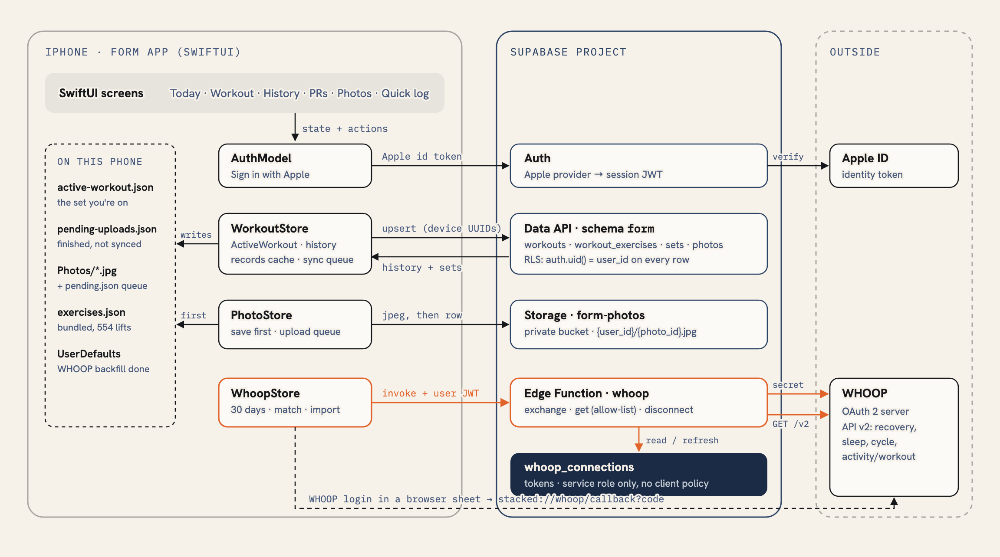

<details>
<summary>Mermaid source</summary>

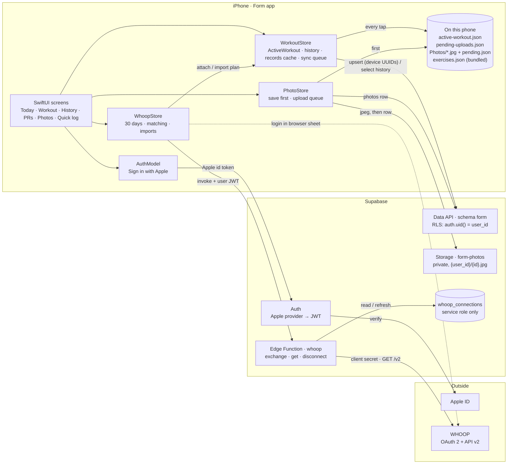
</details>

**How to read it**

- Each phone-side store talks to one Supabase service.
- `WorkoutStore` and `PhotoStore` write to local files before any network call.
- WHOOP is reachable only through the `whoop` edge function. The app never sees the client secret or WHOOP tokens.
- The WHOOP login page opens in an `ASWebAuthenticationSession` sheet on the phone. It returns to `stacked://whoop/callback?code&state`.

---

## 2. Data model

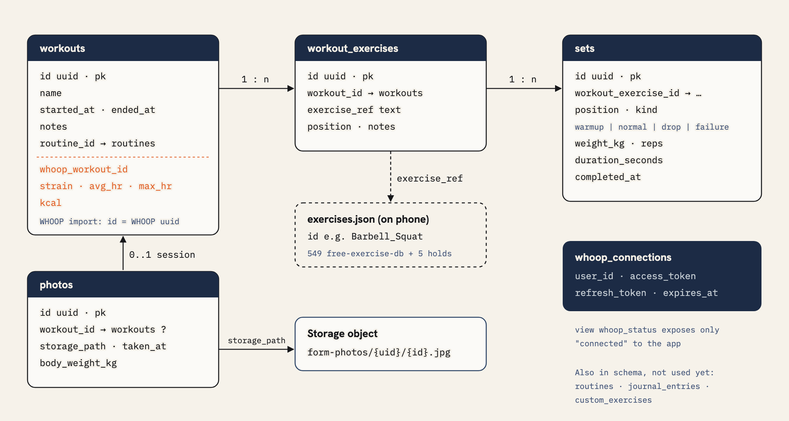

<details>
<summary>Mermaid source</summary>

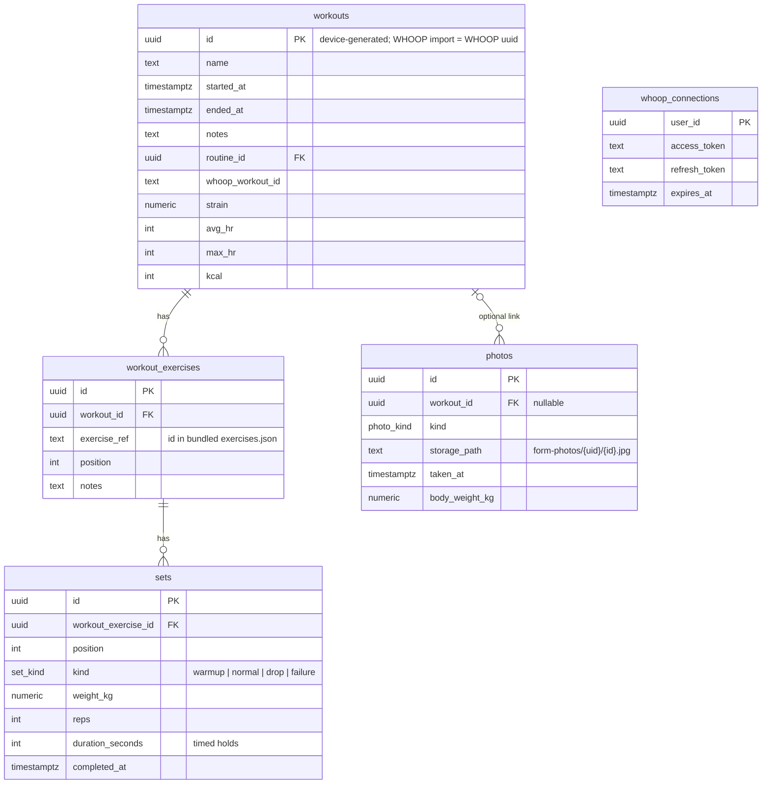
</details>

**Rules that apply to every table**

- Every client table has `user_id uuid not null default auth.uid()` and one policy, `owner_all`: `auth.uid() = user_id` for select, insert, update and delete.
- `whoop_connections` has RLS on and **no** client policy, so only the service role (the edge function) can read it. The view `whoop_status` exposes only "is connected" to the app.
- Storage policies on `storage.objects` allow `select`, `insert`, `update` and `delete` only when the first folder of the path equals `auth.uid()`.

**How one `sets` table covers every kind of exercise**

The exercise decides the metric, not the row (`ExerciseMetric` in `Models/Exercise.swift`):

| Metric | Examples | What a set stores | What counts as a PR |
|---|---|---|---|
| `weightReps` | bench, squat, curls | `weight_kg`, `reps` | best est. 1RM (Epley), then heaviest |
| `bodyweightReps` | pull-ups, push-ups, dips | `reps`, optional added `weight_kg` | most reps |
| `duration` | dead hang, plank, L-sit | `duration_seconds`, optional added `weight_kg` | longest hold |

**Other storage**

- The exercise library is `ios/Form/Resources/exercises.json`: 549 exercises from free-exercise-db (public domain), plus 5 built-in holds. Rows store only `exercise_ref`.
- Also in the schema but not used yet: `routines`, `routine_exercises`, `journal_entries`, `custom_exercises`.

---

## 3. Sequences

### 3.1 Log a set, finish, sync

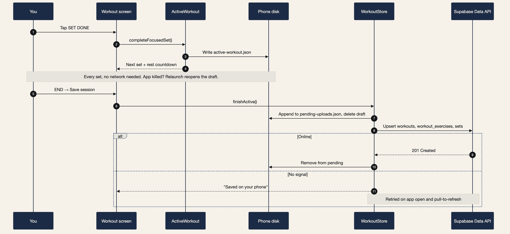

<details>
<summary>Mermaid source</summary>

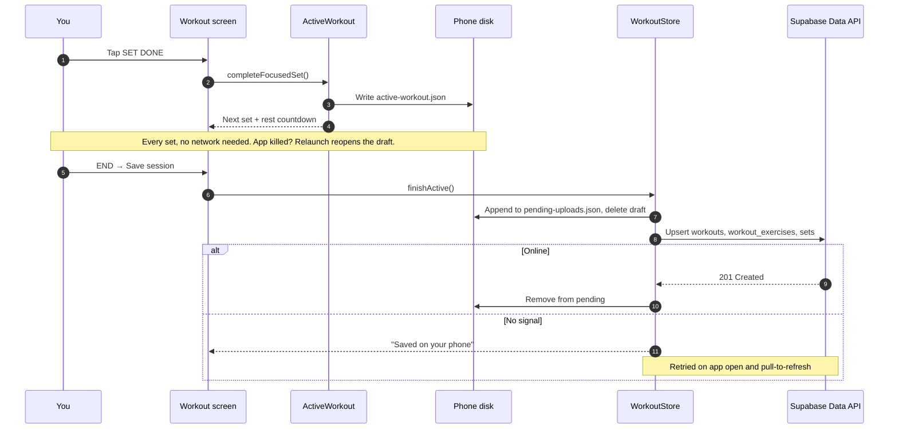
</details>

- Only completed sets are uploaded.
- Device UUIDs make every write an upsert, so a retry after a timeout updates the same rows.
- `syncPending()` is single-flight, and a draft leaves the queue only after it uploads.

### 3.2 Connect WHOOP

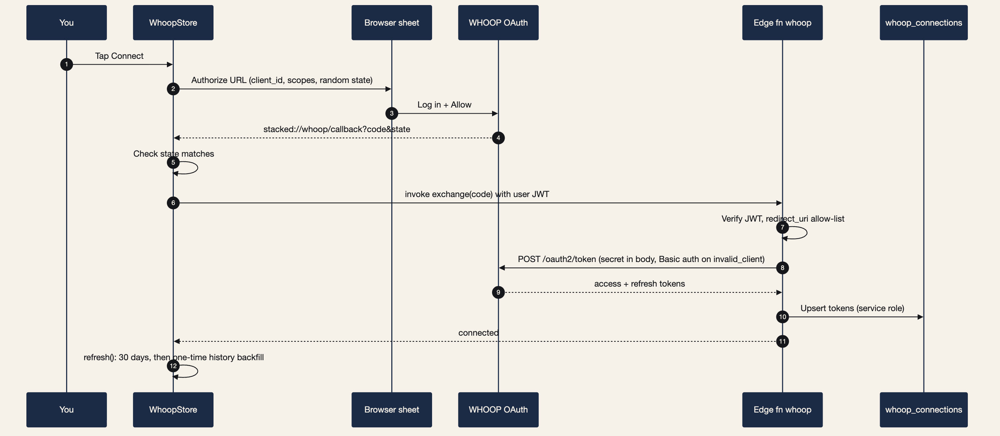

<details>
<summary>Mermaid source</summary>

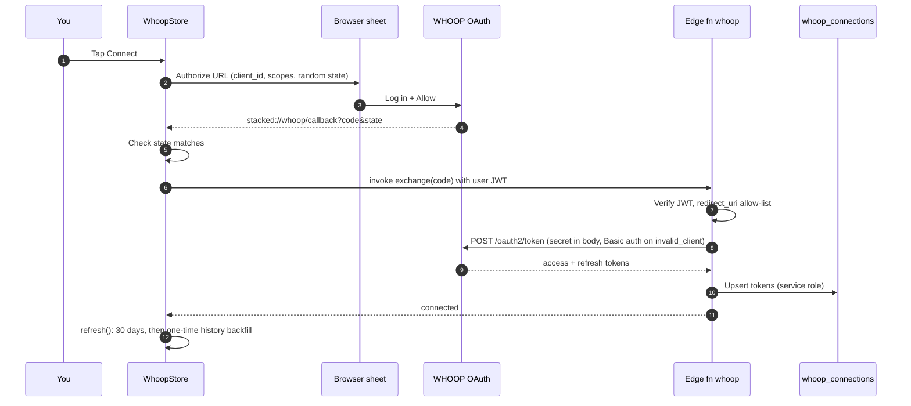
</details>

- **Scopes:** `read:recovery read:sleep read:workout read:cycles read:profile offline`
- **Disconnect:** revokes access at WHOOP (`DELETE /v2/user/access`) and deletes the row.

### 3.3 WHOOP sync and matching

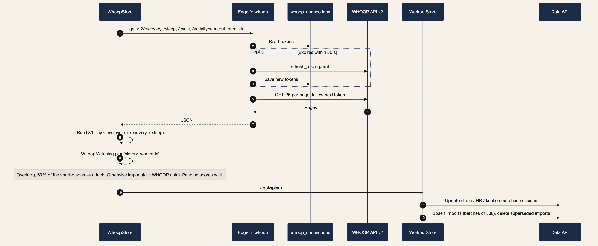

<details>
<summary>Mermaid source</summary>

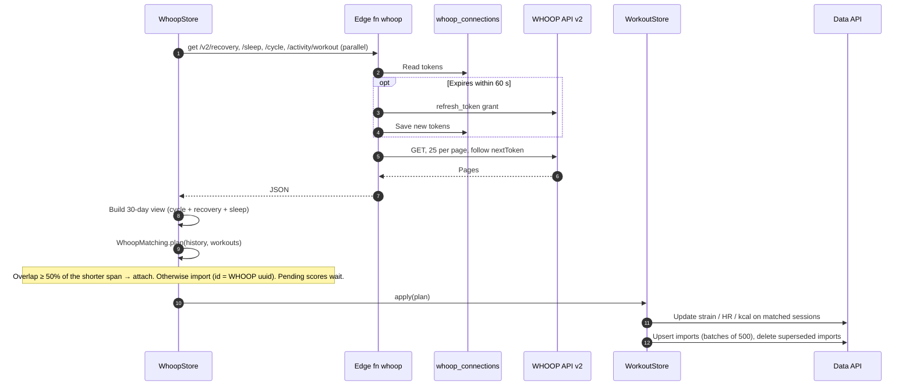
</details>

**Matching rules** (`WhoopMatching.plan`, a pure function with unit tests):

1. Only `SCORED` WHOOP workouts count.
2. For each logged session without WHOOP data, take the unclaimed WHOOP workout with the largest overlap. The overlap must cover at least 50% of the shorter of the two spans.
3. A matched WHOOP workout writes strain, average and max heart rate, and kcal (`kilojoule / 4.184`) onto the session.
4. Unmatched WHOOP workouts are imported as sessions whose id is the WHOOP UUID. This makes re-imports idempotent.
5. If a logged session later matches an earlier import, the import is deleted and its data moves onto the session.

**When it runs:** after connecting, on app foreground, and on pull-to-refresh. The full-history backfill runs once, tracked in `UserDefaults` (`whoop.historyImported`). History → ••• → *Import all WHOOP history* runs it again manually.

### 3.4 Take a progress photo

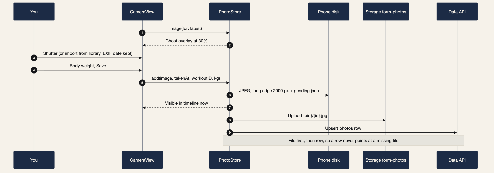

<details>
<summary>Mermaid source</summary>

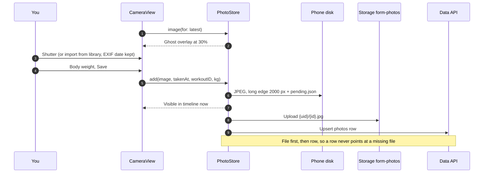
</details>

- Grid thumbnails are downsampled from disk with ImageIO and cached in `NSCache`. A missing file is downloaded once, then cached.
- Collages and comparisons are rendered locally with `UIGraphicsImageRenderer`. They leave the phone only through the share sheet.

---

## 4. Key decisions

| Decision | Why |
|---|---|
| **Offline-first** | Gyms have bad signal. Drafts, finished workouts and photos are written to disk before the network. |
| **Device-generated UUIDs** | Every write is an upsert, and every retry is safe. |
| **Write-then-prune edits** | Editing a session upserts the new state, then deletes only removed rows. A dropped connection can leave an extra row, never an empty session. |
| **WHOOP secret only on the server** | The client secret and tokens live in the edge function and a table with no client policy. Error details go to function logs, not the app. |
| **Own `form` schema** | Form shares the Stacked project without table collisions. It must be listed under *Exposed schemas*. |
| **Bundled exercise library** | No network is needed to search exercises. The exercise decides the metric (weight × reps, bodyweight reps, or hold). |
| **Records cached in `WorkoutStore`** | After a WHOOP backfill, history can be thousands of rows. Bests and trends are computed once per history change, not on every redraw. |

---

## 5. Code map

| Layer | Files | Job |
|---|---|---|
| App shell | `App/FormApp.swift`, `App/AppConfig.swift`, `App/DemoMode.swift` (debug) | Tabs, auth gate, stores in the environment, sync on foreground |
| Design system | `Core/Design/Theme.swift`, `Core/Design/Components.swift` | Palette, cast numerals, knurl, primary key, wordmark |
| Persistence | `Core/Persistence/DraftStore.swift` | Active draft and pending uploads on disk |
| Workout | `Features/Workout/*`, `Models/PlateMath.swift`, `Models/Workout.swift` | Active session, loaded bar, holds, rest timer, finish, sync queue |
| History & records | `Features/History/*`, `Features/Records/*`, `Models/Records.swift` | Weekly history, session editor, PRs, benchmarks, quick log |
| WHOOP | `Features/Integrations/*`, `Repositories/WhoopClient.swift`, `Models/Whoop.swift`, `supabase/functions/whoop/index.ts` | OAuth, 30-day trends, matching, imports, backfill |
| Photos | `Features/Photos/*`, `Repositories/PhotoRepository.swift`, `Models/ProgressPhoto.swift` | Ghost camera, timeline, compare, collage, upload queue |
| Database | `supabase/migrations/*.sql` | Schema, RLS, storage policies, hold time, photo weight |
| Tests | `ios/FormTests/*` (43 tests) | Plate math, workout flow, offline sync, WHOOP matching, benchmarks, photos |

Source paths are relative to `ios/Form/Sources/` unless they start with `supabase/` or `ios/`.

---

## 6. Operations

**Migrations** (run in the Supabase SQL Editor, in order; the later two are safe to re-run):

1. `20260926000000_form_schema.sql`: schema, tables, RLS, storage bucket
2. `20260926010000_timed_sets.sql`: `sets.duration_seconds`
3. `20260926020000_photos.sql`: `photos.body_weight_kg`, storage policies

**Dashboard settings**

- Project Settings → Data API → *Exposed schemas* must include `form`.
- Authentication → Providers → Apple: enabled, with Client ID `com.divyanshu.form`.
- Edge Functions → Secrets: `WHOOP_CLIENT_ID`, `WHOOP_CLIENT_SECRET`, `WHOOP_REDIRECT_URIS=stacked://whoop/callback`.

**Deploying the edge function:** the CLI account on the dev Mac lacks deploy rights on this project. Paste `supabase/functions/whoop/index.ts` into Dashboard → Edge Functions → whoop → Code → Deploy. Keep *Verify JWT* on.

**Building for the phone**

```sh
cd ios && xcodegen generate
xcodebuild -project Form.xcodeproj -scheme Form -configuration Debug \
  -destination 'id=<device-udid>' -derivedDataPath build/device -allowProvisioningUpdates build
xcrun devicectl device install app --device <device-udid> build/device/Build/Products/Debug-iphoneos/Form.app
```

**Regenerating the diagram PNGs** (sources live in `docs/diagrams/`):

- `hld.svg` and `data-model.svg` are hand-drawn. Render them with headless Chrome at 2×, or open them in any browser.
- `seq-*.mmd` are Mermaid. Run: `npx @mermaid-js/mermaid-cli -i docs/diagrams/seq-photo.mmd -o docs/diagrams/seq-photo.png -b '#F6F2EA' -s 2 -w 1400`

**Demo mode (debug builds only):** launch arguments swap in sample data and skip sign-in.

| Argument | Effect |
|---|---|
| `-demo` | Skip sign-in, use sample data |
| `-demoWorkout` | Open straight into a bench session |
| `-demoHold` | Open a dead-hang hold in progress |
| `-demoTab N` | Open tab N |
| `-demoCollage` | Open a sample collage |

---

## 7. What's next

- **Journal:** daily note, mood, energy and body weight, linked to that day's session and photo (`form.journal_entries` already exists).
- **Apple Health:** heart-rate curve during sessions, and writing workouts to Health.
- **Routines, and the rest timer as a Live Activity** on the lock screen.
- **From the code review:** search in History, default rest times per exercise type, and reordering exercises mid-workout.
